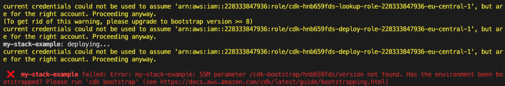

# VPC Basics

## In this lab …

- Setting up AWS CDK
- Setting up a Virtual Private Network

## Bootstrapping

### 📝 Task

Create a fresh AWS CDK app.

### 🔎 Hints

- [Getting started with CDK](https://docs.aws.amazon.com/cdk/v2/guide/getting_started.html)

### 🗺  Step-by-Step Guide

1. Create a new folder `lab1`:
   ```bash
   mkdir lab1
   ```
1. Step into the folder:
   ```bash
   cd lab1
   ```
1. Init AWS CDK with Projen:
   ```bash
   npx cdk init app --language=python
   ```
1. Go to the file `./app.py`. Scroll down and find this line:
  ```python
  Lab1Stack(app, 'Lab1Stack');
  ```
  Rename `my-stack-dev` to something unique (e.g. append your name).
1. Deploy the CloudFormation stack:
   ```bash
   npx cdk deploy
   ```
   ⚠️You might run into the following error:

   

   If this is the case, you need to bootstrap your environment first by running:

   ```bash
   cdk bootstrap
   ```

   Afterwards you can go ahead and deploy your CloudFormation stack.

## AWS VPC

### 📝 Task

Create a VPC with default settings.

### 🔎 Hints

- [What is a VPC?](https://docs.aws.amazon.com/vpc/latest/userguide/what-is-amazon-vpc.html)

### 🗺  Step-by-Step Guide

1. Open 
   ```bash
   lab1/lab1_stack.py
   ```
1. Add the following code to the constructor of Lab1Stack:
   ```python
   ec2.Vpc(self, "VPC")
   ```
   
   Make sure to also add the required imports. The import section should look like this:
   ```python
   from aws_cdk import (
       Stack,
       aws_ec2 as ec2,
   )
   from constructs import Construct
   ```

1. Deploy the latest changes: `npx cdk deploy`

1. Go to the [CloudFormation console](https://eu-west-1.console.aws.amazon.com/cloudformation/home) and select stacks in
   the menu. Here you will find the CloudFormation (cfn) stack you just deployed. If you go to the resources tab, you
   will be shown a tree view of the resources you just created. The tree view resembles all constructs in your CDK code.

1. Now go to [VPC](https://eu-west-1.console.aws.amazon.com/vpc/home). Here you will find the resources as shown in the
   resources view of CloudFormation. Oftentimes, resources are also linked from the CloudFormation console, but
   unfortunately this does not apply to all resources.

1. Task: Discuss the resources and how they work with your colleagues briefly.


---

You can find the complete implementation of this lab [here](https://github.com/superluminar-io/serverless-workshop/tree/main/packages/lab1).
